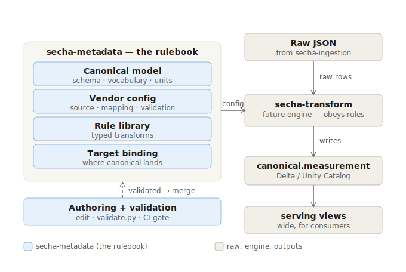
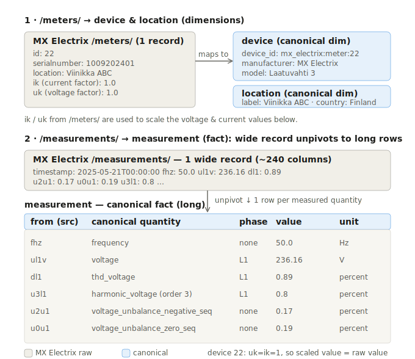

# secha-metadata

> The **metadata repository** for the SECHA EV-charging data interoperability engine — the single
> source of *transformation knowledge*, as config-as-code.

The deterministic transform engine (`secha-transform`) contains **no** vendor logic — it only
*interprets* the files in this repo. Onboarding a vendor is therefore a **pull request here**, not an
engine release. That decoupling is the central interoperability claim of the thesis.

## Architecture at a glance



The rulebook (canonical model, vendor config, rule library, target binding) plus raw JSON from
`secha-ingestion` feed the future `secha-transform` engine, which writes canonical data to Delta /
Unity Catalog. Configs are **authored → validated → CI-gated** before they are trusted.

## Where this fits in the SECHA system
```
secha-ingestion  →  raw JSON (Bronze)
secha-metadata   →  the transformation rulebook (config-as-code)        ← this repo
secha-transform  →  reads raw + rulebook → canonical data (Delta / UC)  ← next milestone
```

## Layout
```
canonical/      target model: canonical_schema.yaml + quantity_vocabulary.yaml + units.yaml
transforms/     library.yaml — typed transformation-rule registry
targets/        canonical.yaml — shared sink binding (catalog.schema.table, merge key, partitions)
meta-schemas/   JSON Schemas that validate the configs themselves
vendors/<v>/    source_schema.yaml + mapping.yaml + validation.yaml + CHANGELOG.md
tests/          fixtures (golden) + config-validity + lineage-drift tests
validate.py     schema + cross-reference + no-collapse linter
lineage.py      generates docs/lineage_<vendor>.md from the configs
docs/           architecture diagrams + generated lineage reports
```

## Metadata types (YAML for human-authored config; JSON for the validators)
| Type | File | Notes |
|---|---|---|
| Canonical target schema | `canonical/canonical_schema.yaml` (+ vocab, units) | long fact + thin dims, standards-aware |
| Source schema metadata | `vendors/<v>/source_schema.yaml` | header stub + **format/locale** block + fields (verbatim vendor descriptions) |
| Mapping metadata | `vendors/<v>/mapping.yaml` | LAV source→canonical, semver-versioned |
| Transformation rules | `transforms/library.yaml` | **typed** (parameter signatures) |
| Validation rules | `vendors/<v>/validation.yaml` | row-level only (scope) |
| Schema versions | `mapping_version` + `vendors/<v>/CHANGELOG.md` | compatibility policy below |
| Target/sink binding | `targets/canonical.yaml` | shared, not per-vendor |

## How the MX Electrix slice maps (meters → dimensions, measurements → fact)



One `/meters/` record becomes the **device** + **location** dimensions (its `ik`/`uk` factors feed
value scaling). One *wide* `/measurements/` record **unpivots into many long rows** — one per measured
quantity, each a self-describing `(quantity · phase · value · unit)` tagged with the source field it came
from. The same physical thing always takes the same row shape, so a future vendor's phase-L1 current
lands as another `current · L1` row in the *same* table — that convergence is interoperability.

A full, auto-generated field-by-field trace lives in
[docs/lineage_mx_electrix.md](docs/lineage_mx_electrix.md) (produced by `lineage.py`).

## How extensibility works (the point)
A new vendor's new measurement type = **add one entry to `quantity_vocabulary.yaml` + one mapping line
→ a new ROW** in the canonical fact. No new column, no new table, no migration. A genuinely new entity
(different grain) gets a new sibling table; an unclassifiable field goes to a side-pocket.

## Validation — what makes "config-driven" trustworthy
`validate.py` runs three layers (enforced in CI + pre-commit + `pytest`):
1. **Schema** — every config conforms to its `meta-schemas/*.schema.json`.
2. **Cross-references** — every `quantity`/`phase`/`unit`/`variant`/`transform` exists; every mapping
   `src` exists in the source schema; generated patterns expand to real fields; golden rows conform.
3. **No-collapse** — no two mapped columns share a canonical identity tuple
   `(quantity, phase, variant, harmonic_order, aggregation)`, so nothing silently merges.

A malformed, dangling, or colliding config **cannot merge** — which is exactly what lets the future LLM
authoring assistant propose configs safely (a human just approves the PR). `lineage.py --check` keeps the
generated lineage docs from drifting out of sync with the configs.

## Design decisions (the load-bearing ones)
- **LAV per-source mappings** — each vendor maps independently *to* the canonical; the canonical never
  changes when a partner is added.
- **Standards-aware canonical** — quantities carry a `standard_ref` (IEC 61000-4-30, IEC 61000-4-7,
  IEEE 1459, …); aligned to standards, not conformant to them.
- **Long canonical + wide serving views** — long fact for interoperability; wide pivots for consumers.
- **Identity tuple, no silent collapse** — distinct measurements get distinct identities; additive
  discriminators (aggregation, channel, …) are added as new column families are mapped.

## Compatibility policy
Additive = safe (new optional field / quantity). Rename = column-mapping + new `mapping_version`.
Removal = flag, not fail. Type change / repurpose = forbidden. Bump `mapping_version` (semver) and log
in the vendor `CHANGELOG.md` on every change.

## Adding a new vendor
1. Create `vendors/<vendor>/`: `source_schema.yaml` (header + format/locale + fields), `mapping.yaml`
   (LAV), `validation.yaml`, `CHANGELOG.md`.
2. Add any new quantities to `canonical/quantity_vocabulary.yaml` (and units to `units.yaml` if needed).
3. Run `python validate.py` and `python lineage.py`; open a PR. CI gates it. **No engine change.**

## Develop
```bash
uv sync --dev
uv run python validate.py        # schema + cross-reference + no-collapse
uv run python lineage.py         # regenerate docs/lineage_<vendor>.md
uv run python lineage.py --check # fail if lineage docs are stale
uv run pytest
uv run ruff check .
```
(No uv? `python -m venv .venv && .venv/Scripts/pip install pyyaml jsonschema pytest ruff`, then run the
same commands without the `uv run` prefix.)

## Status / open items
- **Scope:** vertical slice — MX Electrix `/measurements/` only. Scaled columns (`uk`/`ik`) are declared;
  the golden fixture covers the coefficient=1 subset until the engine + device-factor join exist.
- **Confirm:** energy-counter units (Wh vs kWh), device-factor direction, `/measurements/`
  `fields` completeness.
- **Full-schema discriminators** (per-column `aggregation`, `channel`, text values, DC quantities) are a
  documented, additive next step before mapping beyond the slice for now.
