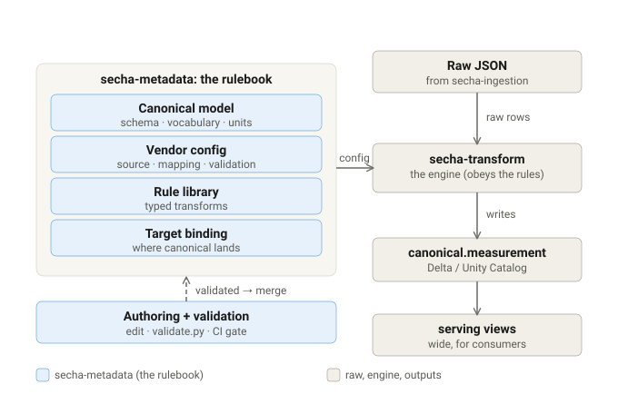
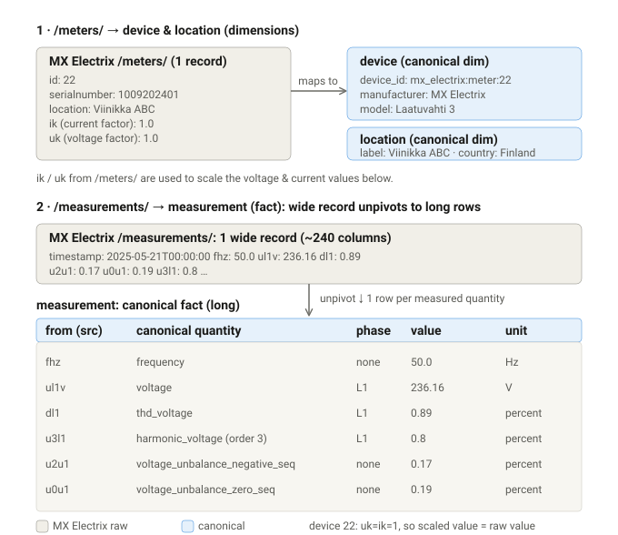

# secha-metadata

> The **metadata repository** for the SECHA EV-charging data interoperability engine: the single
> source of *transformation knowledge*, as config-as-code.

The deterministic transform engine (`secha-transform`) contains **no** vendor logic; it only
*interprets* the files in this repo. Onboarding a vendor is therefore a **pull request here**, not an
engine release. That decoupling is the central interoperability claim of the thesis, and it has now
been demonstrated twice (MX Electrix, then ProCem).

## Architecture at a glance



The rulebook (canonical model, vendor config, rule library, target binding) plus raw data from
`secha-ingestion` feed the `secha-transform` engine, which writes canonical data to Delta /
Unity Catalog. Configs are **authored → validated → CI-gated** before they are trusted.

## Where this fits in the SECHA system
```
secha-ingestion  →  raw data (Bronze)
secha-metadata   →  the transformation rulebook (config-as-code)        ← this repo
secha-transform  →  reads raw + rulebook → canonical data (Delta / UC)  ← the engine (built)
```

## Layout
```
canonical/      target model: canonical_schema.yaml + quantity_vocabulary.yaml + units.yaml
transforms/     library.yaml, the typed transformation-rule registry
targets/        canonical.yaml, the shared sink binding (catalog.schema.table, merge key,
                partitions, table properties, staging, serving schema)
serving/        wide serving views as config: one SELECT per <name>.sql over {canonical}
meta-schemas/   JSON Schemas that validate the configs themselves
vendors/<v>/    source_schema.yaml + mapping.yaml + validation.yaml + CHANGELOG.md
tests/          fixtures (golden) + config-validity + lineage-drift tests
specs/          propose.py inputs: the human-authored facts a draft cannot infer
experiments/    research tooling, outside the CI-gated contract (llm_mapping/, kempower_heldout/)
validate.py     schema + cross-reference + no-collapse + serving-view linter
propose.py      drafts a whole vendor directory from a partner catalog, gated by validate
lineage.py      generates docs/lineage_<vendor>.md from the configs
review_sheet.py builds the domain-expert review workbook from the configs
docs/           architecture diagrams + generated lineage reports + the onboarding diaries
```

## Metadata types (YAML for human-authored config; JSON for the validators)
| Type | File | Notes |
|---|---|---|
| Canonical target schema | `canonical/canonical_schema.yaml` (+ vocab, units) | long fact + thin dims, standards-aware |
| Source schema metadata | `vendors/<v>/source_schema.yaml` | header stub + **shape/format/locale** blocks + `record` interpretation (and a `session` block for charging-session sources) + fields (verbatim vendor descriptions where the vendor gives them) + the vendor's `naming_convention` |
| Mapping metadata | `vendors/<v>/mapping.yaml` | LAV source→canonical; wide `columns:` or long `rows:`; semver-versioned |
| Transformation rules | `transforms/library.yaml` | **typed** (parameter signatures) |
| Validation rules | `vendors/<v>/validation.yaml` | row-level only (scope) |
| Schema versions | `mapping_version` + `vendors/<v>/CHANGELOG.md` | compatibility policy below |
| Proposal spec | `specs/<v>.spec.yaml` | `propose.py` input: identity, access, format, record, naming convention, candidate validation thresholds, and how to read the vendor catalog |
| Target/sink binding | `targets/canonical.yaml` | shared, not per-vendor; incl. platform table properties + staging |
| Serving views | `serving/<name>.sql` | one SELECT over `{canonical}`; materialised per the target's `serving_mode` (view, or Delta snapshot) |
| Reference dimensions | `targets/canonical.yaml` `reference_dimensions` | published from a vocabulary (e.g. `quantity`); consumers JOIN the long fact for descriptions + standards |

## Drafting a vendor: `propose.py`

Onboarding is a pull request here, and the slow part of that pull request is reading a
vendor catalog point by point to decide what each one means. `propose.py` drafts that
decision for a whole catalog and refuses to emit anything the validator would reject.

```bash
python propose.py --spec specs/<vendor>.spec.yaml --dry-run   # inspect the prompt
python propose.py --spec specs/<vendor>.spec.yaml --limit 10  # cheap trial
python propose.py --spec specs/<vendor>.spec.yaml             # draft into proposals/<vendor>/
python propose.py --spec specs/<vendor>.spec.yaml --apply     # install once validated
```

It calls the model over HTTP with `requests`, which the CI-gated contract does not install;
`pip install -r experiments/llm_mapping/requirements.txt` provides it.

**Only semantics are inferred**: quantity, phase, unit, variant, harmonic_order. Every
operational fact (owner, access layout, format, record fields) and every validation
threshold is human-authored in the spec, because those are decisions about a system and a
domain rather than readings of a point name. The spec has its own meta-schema, so the
input to the generator is validated config like everything else here.

**The gate is real.** A draft is validated in a staging copy of the repository that
contains only the proposed vendor, so `vendors/` is never touched until the proposal is
clean, and a rejected draft leaves nothing behind. Nothing is installed without `--apply`,
and `--apply` refuses to overwrite an existing vendor.

**A clean validator run is the start of the review, not the end.** On ProCem, proposals are
98 to 100% valid and 38 to 84% correct, so almost every wrong proposal is still a legal config.
On the held-out vendor, Kempower, the DC columns needed a phase value the vocabulary lacked; the
drafts put them on existing phases, 7 of 18 on an AC phase, and the validator flagged none of them. Every generated file says so in its header, and
`PROPOSAL.md` lists each entry with advisory notes for the checks the validator cannot
make, such as a unit that could not measure the quantity it was paired with.

Proposing a whole catalog at once is more checkable than proposing one point at a time.
The no-collapse invariant only has teeth when both of two colliding points are in scope:
a fundamental component mapped as if it were the plain quantity is one wrong field in
isolation, but two source points sharing one canonical identity when the catalog is
proposed together, which is a hard rejection rather than a judgement call.

## Asking for a domain review

The people who use this data are the ones who can say whether a point means what we
claim. `review_sheet.py` turns the configs into a workbook they can answer in, so a
review comes back as structured answers rather than prose.

```bash
pip install openpyxl                                   # not in the CI-gated contract
python review_sheet.py --out ../review                 # one workbook per vendor
python review_sheet.py --vendor mx_electrix
```

Each workbook holds every mapped point with a verdict column beside it, the catalog
points no entry claims and why, the validation limits in plain words, the canonical
vocabulary, and the questions from `review_questions.yaml` that only a domain expert
can settle. The mapping rows are built with the same helpers as
`docs/lineage_<vendor>.md`, so the two can never describe an entry differently.

## How the two vendor shapes map



**Wide (MX Electrix):** one `/meters/` record becomes the **device** + **location** dimensions (its
`ik`/`uk` factors feed value scaling). One *wide* `/measurements/` record **unpivots into many long
rows**, one per measured quantity, each a self-describing `(quantity · phase · value · unit)` tagged
with the source field it came from.

**Long (ProCem):** each raw record is already one reading, a `(rtl_id, value, epoch_ms)` triple; the
mapping's `rows:` table (keyed by rtl_id, curated from the platform catalog) gives it meaning.

**Sessions (Kempower):** a wide source whose rows are 10-second steps of charging sessions, with no
clock time. The `session:` block names the session id, the seconds-since-start field and the
columns that fill the `charging_session` entity; the rest unpivots like any wide record.

The same physical thing always takes the same row shape: ProCem's phase-L1 voltage lands as another
`voltage · L1` row in the *same* table as MX Electrix's. That convergence **is** interoperability,
and it is now demonstrated live (one query, both vendors, identical columns).

Full, auto-generated field-by-field traces live in
[docs/lineage_mx_electrix.md](docs/lineage_mx_electrix.md),
[docs/lineage_procem_kampusareena_pq.md](docs/lineage_procem_kampusareena_pq.md) and
[docs/lineage_kempower.md](docs/lineage_kempower.md) (produced by `lineage.py`).

## How extensibility works (the point)
A new vendor's new measurement type = **add one entry to `quantity_vocabulary.yaml` + one mapping line
→ a new ROW** in the canonical fact. No new column, no new table, no migration. A genuinely new entity
(different grain) gets a new sibling table; an unclassifiable field goes to a side-pocket.
Measured evidence: onboarding ProCem (68 variables incl. Fryze/fundamental variants, harmonics,
unbalance, energy counters) required **zero** vocabulary or unit-registry changes. Kempower, the first
source from outside power quality, used exactly this mechanism: two quantities (`state_of_charge`,
`temperature`) and one phase value (`dc`), each an additive entry (vocabulary 1.3.0, canonical 1.1.0).

## Validation: what makes "config-driven" trustworthy
`validate.py` runs three layers (enforced in CI + pre-commit + `pytest`):
1. **Schema.** Every config conforms to its `meta-schemas/*.schema.json`.
2. **Cross-references.** Every `quantity`/`phase`/`unit`/`variant`/`transform` exists; every wide
   mapping `src` exists in the source schema; generated patterns expand to real fields; long `rows:`
   mappings are consistent with the declared shape and record block; a `session` block names real
   fields and real `charging_session` attributes; transform args are complete and known; golden rows
   conform to the vocabulary.
3. **No-collapse.** No two mapped columns/rows share a canonical identity tuple
   `(quantity, phase, variant, harmonic_order, aggregation)`, so nothing silently merges.

Serving views get the same treatment: a view file must be a single SELECT/WITH (no DDL/DML can
hide in one) and must reference the fact table through the `{canonical}` placeholder, so views
stay platform-portable and always read the canonical fact.

A malformed, dangling, or colliding config **cannot merge**, which is what lets `propose.py` drafts be
gated automatically. It cannot make a draft right: on the held-out vendor, every draft put the DC
columns on a phase the vocabulary already had, and the validator flagged none of them
([experiments/kempower_heldout/FINDINGS.md](experiments/kempower_heldout/FINDINGS.md)). A human still
reads the diff. `lineage.py --check` keeps the generated lineage docs from drifting out of sync with the
configs.

## Design decisions (the load-bearing ones)
- **LAV per-source mappings.** Each vendor maps independently *to* the canonical; the canonical never
  changes when a partner is added.
- **Standards-aware canonical.** Quantities carry a `standard_ref` (IEC 61000-4-30, IEC 61000-4-7,
  IEEE 1459, …); aligned to standards, not conformant to them.
- **Long canonical + wide serving views.** Long fact for interoperability; wide pivots for consumers.
- **Identity tuple, no silent collapse.** Distinct measurements get distinct identities; additive
  discriminators (per-row `aggregation` arrived with ProCem, per-column `aggregation` with Kempower;
  `channel` and others follow) are added as new column families are mapped. A source with no clock
  time keeps its readings distinct through the row id: for Kempower, the row's position in its
  immutable landed part (`record.row_id_from: payload_position`), so no existing id changed.
- **Explicit `rows:` tables over clever classification.** Long sources map by an explicit, validated
  rtl_id table (generated once from the vendor catalog, then curated), not by name-pattern regexes:
  auditable, diffable, and guarded by the same three validation layers.
- **Document the source, not just the mapping.** A vendor's `naming_convention` records the grammar
  of its point names in prose. It costs a few lines and it is what a human author needs anyway.
  Measured: supplying it raised model authoring accuracy from 54% to 79%, the same gain as a dozen
  worked examples (`experiments/llm_mapping/findings.md`).

## Compatibility policy
Additive = safe (new optional field / quantity). Rename = column-mapping + new `mapping_version`.
Removal = flag, not fail. Type change / repurpose = forbidden. Bump `mapping_version` (semver) and log
in the vendor `CHANGELOG.md` on every change.

## Adding a new vendor
1. Create `vendors/<vendor>/`: `source_schema.yaml` (header + shape + format/locale + record, a
   session block where rows belong to charging sessions, + fields), `mapping.yaml` (wide `columns:` or
   long `rows:`), `validation.yaml`, `CHANGELOG.md`.
2. Add any new quantities to `canonical/quantity_vocabulary.yaml` (and units to `units.yaml` if needed).
3. Run `python validate.py` and `python lineage.py`; open a PR. CI gates it. **No vendor-specific
   engine change**; a source unlike any before may first need a generic capability.

Proven end to end three times. The first two are `mx_electrix` (wide JSON over an authenticated API) and
`procem_kampusareena_pq` (long tab-separated triples from daily file archives); the cost of the second
is logged in [docs/onboarding-diary-procem.md](docs/onboarding-diary-procem.md). The third, `kempower`
(charging sessions in a Parquet export, with no clock time), is the held-out test: nothing was tuned
on it. It needed generic engine capabilities (a Parquet reader, sessions, a positional row id), built
without vendor logic, and no rulebook change to reach Unity Catalog. Its onboarding began with a
pre-registered, sealed `propose.py` draft
([experiments/kempower_heldout/PROTOCOL.md](experiments/kempower_heldout/PROTOCOL.md)), and its cost is
logged in [docs/onboarding-diary-kempower.md](docs/onboarding-diary-kempower.md).

## Develop
```bash
uv sync --dev
uv run python validate.py        # schema + cross-reference + no-collapse
uv run python lineage.py         # regenerate docs/lineage_<vendor>.md
uv run python lineage.py --check # fail if lineage docs are stale
uv run pytest
uv run ruff check . && uv run ruff format --check .
```
(No uv? `python -m venv .venv && .venv/Scripts/pip install pyyaml jsonschema pytest ruff`, then run the
same commands without the `uv run` prefix.)

## Status / open items
- **Scope:** three vendors configured, all consumed end to end by `secha-transform`.
  (1) MX Electrix `/measurements/` (wide JSON API): a full real day, 1,440 records → ~36,000 canonical
  rows; the golden fixture pins the coefficient=1 subset.
  (2) ProCem Kampusareena EV-charging PQ (`vendors/procem_kampusareena_pq/`, long 1 Hz triples +
  catalog semantics via the additive `rows:` construct): a full real day, 14,476,804 records →
  5,499,568 canonical rows, with unmapped ids counted, never silent. One query now returns both
  vendors' voltage in identical canonical shape.
  (3) Kempower (a wide Parquet export of charging sessions, no clock time): all 99 landed parts,
  71,793,566 records → 358,967,830 canonical rows and 396,848 sessions, reconciled against the raw
  export.
- **Deployed (Phase 3):** the target binding in this repo drives the live platform sink.
  `secha.canonical.measurement` holds 41,884,113 rows: the first two vendors' 5,535,568 and every
  tenth Kempower part, 36,348,545 (the full export waits on a platform limit). With
  `secha.canonical.charging_session` (40,175 sessions, loaded through the `dimensions:` binding) and
  the `secha.serving.pq_minute_wide` snapshot, it exists in Unity Catalog on the TUNI cluster, created
  from this rulebook's DDL, table properties, and `serving/` definitions; MERGE re-runs are
  idempotent.
- **Confirmed with the data platform:** energy counters are **kWh/kvarh** (despite `wh`/`varh` attribute
  names); device-factor scaling is **multiply** by `uk`/`ik`; omitting the API `fields` param returns all
  fields; MX Electrix timestamps are UTC; ProCem day files rotate at **Helsinki-local** midnight.
- **Open (ProCem):** are the 1 Hz values instantaneous samples or 1-second aggregates
  (recorded as `average` @ `interval_s: 1` pending confirmation)? Values are final engineering units?
  The EVCharging feed stopped logging 2026-06-28.
- **Full-schema discriminators** (per-column `aggregation` for wide sources, `channel`, text values,
  DC quantities) remain a documented, additive next step before mapping beyond the slice.
